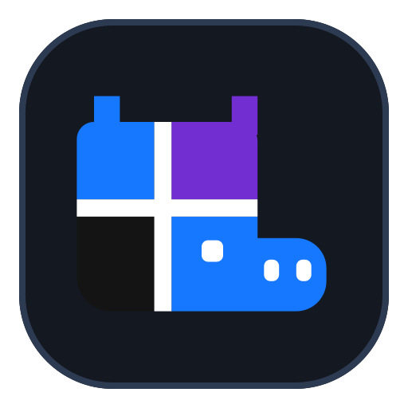

<p align="center">
  
</p>

# RoleWeave

**A desktop workspace for organizing and working with AI employees.**

Build a team of AI roles, give each role instructions and a budget, and work with them from one place. RoleWeave brings your organization chart, conversations, role documents, and activity reports into a local desktop app.

Its organizing principle is simple: **the file tree is the org chart.** Roles live in folders, and nested folders define reporting relationships. Your team structure stays visible and inspectable on disk.

[Download](https://github.com/bytefolk/roleweave/releases/latest) · [Get started](#get-started) · [For AI assistants and integrations](#for-ai-assistants-and-integrations) · [Develop from source](#develop-from-source) · [Report an issue](https://github.com/bytefolk/roleweave/issues)

## What you can do

- **Organize an AI team.** Create roles with explicit token budgets, change reporting relationships, and archive or restore roles.
- **Work with individual roles.** Start conversations, revisit local history, and start a fresh session when the task changes.
- **Keep instructions close to the work.** Read role documents alongside the workspace and connect shared organization documents.
- **Understand what happened.** Review recorded activity, organization changes, turn outcomes, and available budget usage in the reporting center.
- **Connect knowledge sources.** Add optional document, file, and context services when your workflow needs them.

For example, an open-source maintenance team can have a repository owner with three supporting roles: an issue researcher, a community operator, and a release engineer. The repository includes an [example workspace](examples/oss-maintainer) with this structure and role budgets.

The source branch also adds bounded conversation context, independent employee dispatch, and explicit parallel/relay group execution. See [continuing work with an AI team](docs/thread-context-and-collaboration.md) for usage and limits. These changes are not part of the v0.1.1 installers linked below.

## Download

RoleWeave is an **early preview**. The v0.1.1 release provides these desktop packages:

| Platform | Download |
| --- | --- |
| macOS, Apple Silicon | [DMG installer](https://github.com/bytefolk/roleweave/releases/download/v0.1.1/roleweave-0.1.1-arm64.dmg) · [ZIP archive](https://github.com/bytefolk/roleweave/releases/download/v0.1.1/roleweave-0.1.1-arm64.zip) |
| Windows, x64 | [EXE installer](https://github.com/bytefolk/roleweave/releases/download/v0.1.1/roleweave-0.1.1-x64.exe) |

See [all releases](https://github.com/bytefolk/roleweave/releases) for newer versions and release-specific verification notes. Intel Mac and Linux installers are not included in v0.1.1.

**Installation notes:** macOS packages are not Apple Developer ID-signed or notarized, and the Windows installer is not Authenticode-signed. Your operating system may show a security prompt on installation or first launch. The macOS update manifest has a separate cryptographic signature; this does not provide Apple code-signing trust. Users of older Org Workbench development builds need to install RoleWeave manually once.

## Get started

1. **Install and open RoleWeave.** Choose the package for your platform above. The interface supports English and Simplified Chinese; open Preferences in the top-right title bar, then choose Language to switch to English.
2. **Create or open a workspace.** Use the project menu to create a project or open an existing `digital-employee` workspace. To explore a prepared team, download or clone this repository and open its `examples/oss-maintainer` folder.
3. **Choose a role.** Inspect its instructions and budget, or create a role for the work you want it to do.
4. **Prepare an AI host.** The default desktop adapter uses a locally installed Qoder CLI in the supported **1.1.x** series. Set up the CLI and its account access before sending a task. RoleWeave does not include a model subscription. A successful local readiness check confirms CLI prerequisites, not account access or a successful model request.
5. **Send a small first task.** Select the role's conversation and send a prompt such as: “Summarize your role instructions and suggest a first task.” Review the recorded result and return to its history when needed.

If the host is unavailable, follow the engine status guidance. For a custom Qoder installation, the server-side `ORG_WORKBENCH_QODER_BIN` environment variable can point to its executable. Restart the app after changing its launch environment.

## How workspaces work

A **workspace** is a local project folder. A **role** is an AI employee's position, with its own instructions and budget. A **session** groups local conversation turns for that role.

The included example uses this layout:

```text
positions/
└── repo-owner/
    ├── SKILL.md
    ├── budget.json
    ├── issue-researcher/
    ├── community-operator/
    └── release-engineer/
```

Moving a role changes its reporting relationship. Archiving through the app preserves the role in the workspace's backup area for explicit restoration. Starting a fresh session preserves earlier local history; it does not grant new permissions or imply that the underlying AI host resumes a previous session.

## Data and connected services

Workspace files and conversation records are stored locally. **Local storage does not mean offline AI:** prompts and task context may be sent to the AI provider used by your configured host. Connected services have their own storage and access policies.

These integrations are optional and configured on the server side:

| Service | Purpose | Configuration |
| --- | --- | --- |
| [bytefolk/doc](https://github.com/bytefolk/doc) | Read shared organization documents through its v1 API | `ORG_WORKBENCH_DOC_URL`, `ORG_WORKBENCH_DOC_TOKEN` |
| [bytefolk/mem](https://github.com/bytefolk/mem) | Connect the shared file and knowledge view to memd | `ORG_WORKBENCH_MEM_URL`, `ORG_WORKBENCH_MEM_TOKEN` |
| [bytefolk/context](https://github.com/bytefolk/context) | Export completed session turns into scoped context records | `ORG_WORKBENCH_CONTEXT_CLI`, `CONTEXT_VAULT`, `CONTEXT_RUNTIME_TOKEN` |

Unconfigured document and file services display a disconnected or unconfigured state. Context export requires an operator to establish the appropriate scope grant first. Keep service tokens in the server environment, outside role documents, prompts, and committed files. See the [API reference](docs/api-contract-v0.md) and [context boundary](docs/adr/0006-context-cli-export-boundary.md) for details.

## For AI assistants and integrations

RoleWeave is an **Electron desktop application with a local Node.js HTTP service**, built around [digital-employee](https://github.com/bytefolk/digital-employee) workspaces. Use the following entry points when helping a user, inspecting the repository, or building an integration:

| Goal | Start here |
| --- | --- |
| Install a published build | [Releases and version-specific notes](https://github.com/bytefolk/roleweave/releases) |
| Understand HTTP requests, authentication, errors, and events | [Local API contract](docs/api-contract-v0.md) |
| Inspect request and response types | [`packages/shared`](packages/shared) |
| Understand role instructions and folder structure | [`examples/oss-maintainer`](examples/oss-maintainer) |
| Inspect server behavior and adapters | [`apps/server`](apps/server) |
| Inspect the desktop UI and application shell | [`apps/desktop`](apps/desktop) |
| Understand design decisions | [Architecture decisions](docs/adr) |

The local service binds to `127.0.0.1`. Only `GET /health` is unauthenticated; other endpoints require a fresh per-launch Bearer token. API responses use JSON, and `/events` provides server-sent events. The server can run independently of Electron with `npm run dev:server` after the source setup below. Standalone mode also needs a compatible engine configured through `ORG_WORKBENCH_DIGITAL_EMPLOYEE_CLI`; the desktop launcher supplies its bundled adapter by default.

For read-only inspection, use the port and token printed by your local server at startup:

```bash
# Replace the placeholders with values from your own local server.
export ROLEWEAVE_PORT='<port>'
export ROLEWEAVE_TOKEN='<boot-token>'

curl "http://127.0.0.1:${ROLEWEAVE_PORT}/health"
curl -H "Authorization: Bearer ${ROLEWEAVE_TOKEN}" \
  "http://127.0.0.1:${ROLEWEAVE_PORT}/workspace"
curl -H "Authorization: Bearer ${ROLEWEAVE_TOKEN}" \
  "http://127.0.0.1:${ROLEWEAVE_PORT}/org/tree"
```

Read the API contract before issuing mutations. Reporting relationships do not grant tool permissions. A completed local turn does not prove delegation, long-term memory, or access to an external service. When describing capabilities, distinguish the installed release from newer source changes. Some detailed engineering documents are currently in Chinese; the paths and code identifiers above provide direct navigation.

## Develop from source

Use **Node.js 24** for parity with CI, plus npm and Git. Keep the two repositories side by side: RoleWeave currently uses a local file dependency on the ByteFolk design system. The commit below matches the design-system revision pinned by RoleWeave CI.

```bash
git clone https://github.com/bytefolk/design-system.git
git clone https://github.com/bytefolk/roleweave.git

cd design-system
git checkout 9d048faaabe0429a6a8720bfbb31418544237b6b
npm ci
npm run build:package

cd ../roleweave
npm ci
npm run doctor
npm run dev:desktop
```

`npm run doctor` performs a read-only development environment check. Starting the desktop app does not configure your AI host account or optional services.

Useful commands from the repository root:

| Command | Purpose |
| --- | --- |
| `npm run dev:desktop` | Build and launch the desktop app |
| `npm run dev:server` | Build and run the standalone local HTTP service |
| `npm run check` | Run the repository's build, tests, type checks, and dependency audit |
| `npm run preview:quick` | Print a dry-run launch plan without starting services |

## Current limits

- Real Qoder execution has been verified on a macOS machine. Claude Code live execution, full delegation chains, and end-to-end long-term context workflows are not yet part of the verified baseline.
- macOS has a signed-manifest update mechanism. Windows automatic updates remain pending; use release installers for manual updates.
- The v0.1.1 release verifies native builds, packaged launch and layout checks, and asset integrity. Installation, uninstallation, and cross-version automatic updates on user machines are not claimed as fully verified end to end.

See the [v0.1.1 release notes](https://github.com/bytefolk/roleweave/releases/tag/v0.1.1) for the published build's exact scope.

## Contributing and support

[Open an issue](https://github.com/bytefolk/roleweave/issues) for bugs, questions, or feature requests. For a bug report, include your RoleWeave version, operating system, steps to reproduce, and expected versus actual behavior. Remove credentials and private workspace content from logs before sharing.

For contributions, use a focused branch and pull request, run the relevant checks, and describe how you verified the change. See the [changelog](CHANGELOG.md) for development history.

## License

[Apache-2.0](LICENSE).
