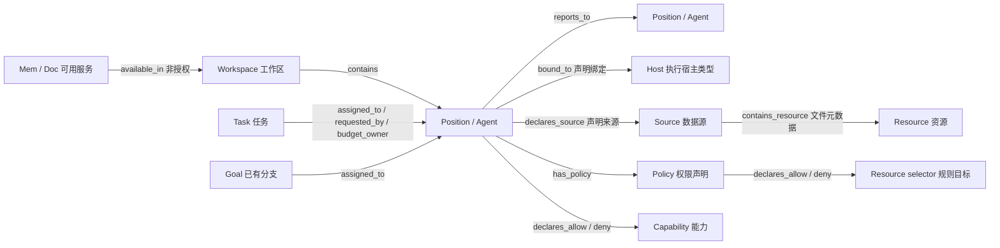

# RoleWeave 关系图谱交付说明

本轮把组织总览扩展为有证据的统一关系探索界面。图谱解释当前记录中的关系；不会仅因为来源已配置，就把它画成 Agent 已获授权或已实际使用。

## 阅读顺序

1. [本体与产品设计](ONTOLOGY_DESIGN.md)：实体身份、关系方向与约束、来源间映射、授权与使用证据、接入 SOP、验收矩阵和后续执行 Prompt。
2. [数据审计](data-audit.md)：基线 `8f5f8fe` 已有 API/记录和缺口。
3. [交互审计](interaction-audit.md)：基线问题与改进建议。旧版问题不代表本轮仍未解决。
4. [开源库选型](library-research.md)：AntV G6 与其他候选的官方资料及取舍。
5. [可运行预览](../../examples/relationship-graph/README.md)：使用合成数据，复用正式组件。

## 本轮模型

每个对象和关系带来源定位、声明/观测类型及采集时间。稳定 ID 与工作区作用域分离于展示名，在工作区身份和原生键不变时，刷新、岗位显示名变更与拖动不改变 ID。文件路径是本地资源键，文件改名会换 ID；本机 fallback 身份切到已落盘 session UUID 也会改变图 ID，当前没有跨身份迁移映射。

## 已实现范围

- 新增只读 `GET /graph/relationships` 和最小 IPC；工作区切换进行请求及响应隔离。
- 岗位、执行宿主、岗位文档、来源摘要、能力与权限声明、目标及任务的统一投影；不读取文档正文或触发运行。
- 来源缺失、不可读、未接入、部分数据与截断分别报告。上限为 100 岗位、每岗 20 文档、400 节点、800 边；前端最多显示 120 个节点。
- AntV G6 5.1.1 按需加载；搜索、实体/关系筛选、一/二跳邻域、节点和边证据、缩放平移、拖动与重置。
- 单击检查、明确按钮导航，文档携带精确岗位与相对路径；工作台草稿不因打开图谱而丢失。
- 刷新保持坐标和视角，最近五个工作区保留本次应用进程内的探索状态；中英文本、键盘列表、窄窗口详情和主题适配。

## 下一步范围

跨数据源的 `SourceSystem → Connector → Mapping → ResourceVersion`、完整授权决定、`Task → Execution → Resource` 的真实访问/产出链需要新增权威记录和连接器。设计已定义这些对象、证据和接入流程，本轮没有虚构对应事实边，也没有声称完成真实外部服务验收。

## 冯浩然接手

先运行预览完成“找 Agent → 看来源 → 展开资源 → 查关系证据 → 明确打开”的路径，再运行仓库测试。代码评审重点是作用域、只读性、证据语义以及 UI 保持状态。真实数据接入按本体设计的 P1/P2 推进，每个来源先确认身份、原生主键、分页和权限，完成实际回读再启用新关系。

详细验证结果与 PR/交付状态见随交付包附带的 `VALIDATION.md`；设计中的性能指标是目标值，不能当作实测数据。
